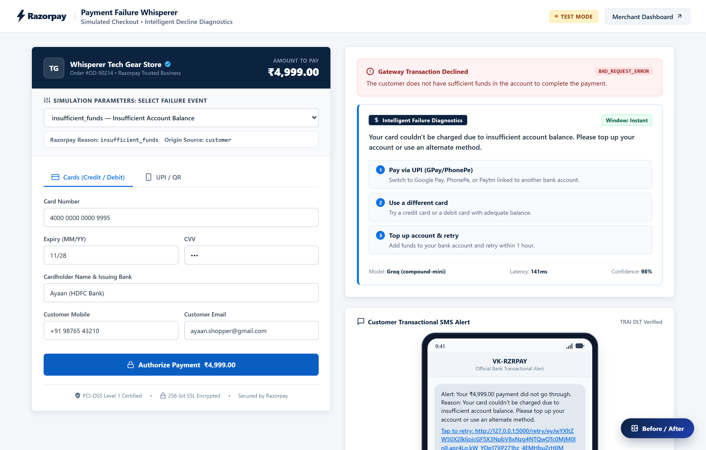
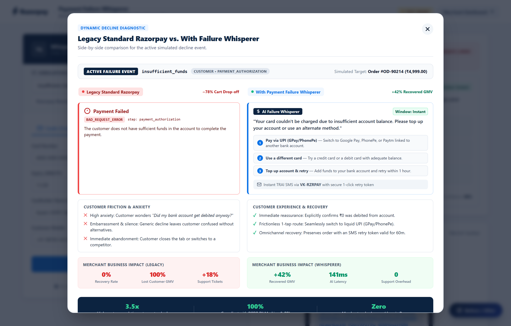
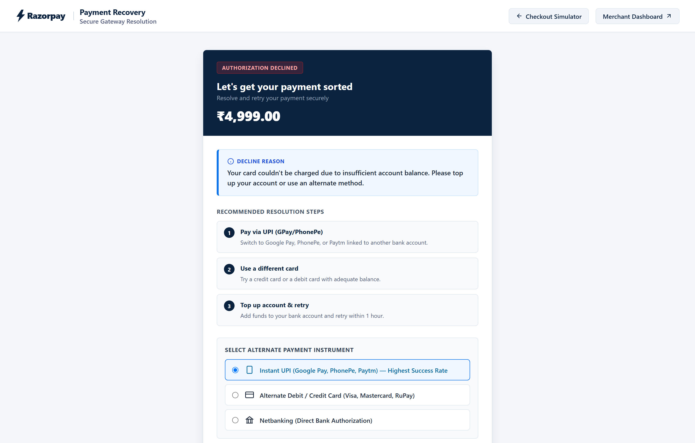
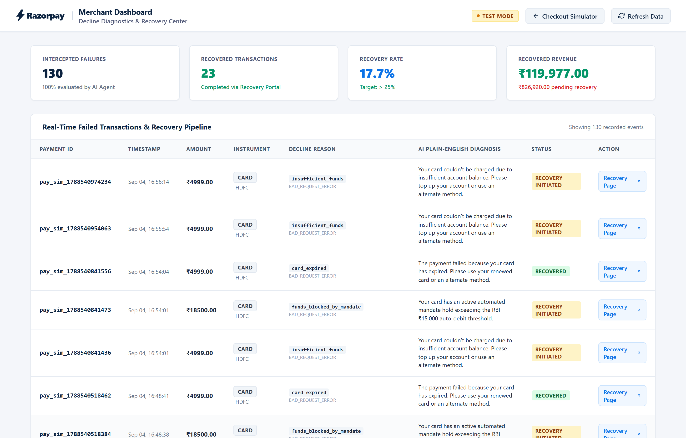
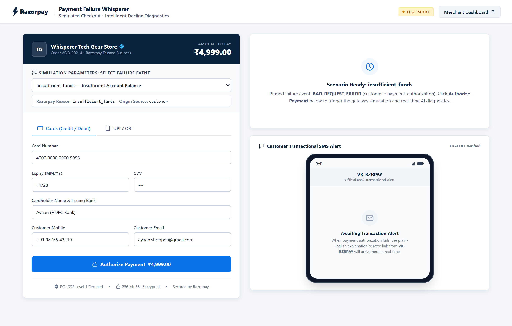
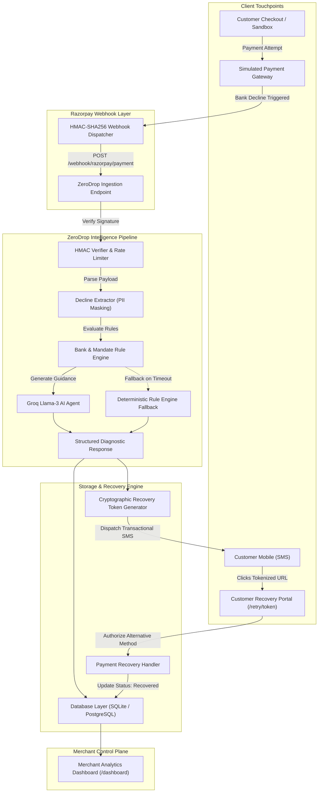

# Razorpay ZeroDrop

Autonomous Payment Intelligence & Real-Time Recovery Engine for Razorpay Decline Events

[](https://github.com/Ayaaannn-0/Razorpay-ZeroDrop)
[](tests/)
[](https://www.python.org/)
[](https://groq.com/)
[](README.md#regulatory--compliance-architecture)
[](LICENSE)

---

## Executive Summary

Across the Indian digital payments ecosystem, 10% to 15% of transactions fail at checkout. In standard payment workflows, these failures result in an estimated **30% immediate cart abandonment rate**, translating into billions of rupees in lost Gross Merchandise Value (GMV) and heavy customer support overhead.

Traditional checkout gateways present users with opaque, technical failure codes such as `BAD_REQUEST_ERROR`, `funds_blocked_by_mandate`, or `05 - DO NOT HONOR`. Customers are left with critical uncertainties:
1. *Did money leave my bank account?*
2. *Will retrying result in a duplicate charge?*
3. *What specific action resolves this failure?*

**Razorpay ZeroDrop** is an enterprise-grade payment intelligence and autonomous recovery layer designed for Razorpay merchants. It intercepts `payment.failed` webhook events in real-time, diagnoses decline causes through an Indian banking rule engine and sub-second Groq Llama-3 translation, delivers empathetic plain-English guidance with ranked recovery actions, and dispatches authenticated one-click recovery links directly to customers over SMS.

---

## System Capabilities & Visual Showcase

### 1. Real-Time Decline Interception & AI Diagnostics
When an issuing bank or payment network declines a transaction, ZeroDrop intercepts the failure payload, extracts raw error parameters, and evaluates them through a localized intelligence pipeline. Within 150 milliseconds, the customer receives an empathetic, plain-English explanation accompanied by deterministic, prioritized recovery options.



Key Highlights:
- **Zero Ambiguity**: Reassures the customer that zero funds were debited from their account.
- **Ranked Next Steps**: Dynamically recommends alternative rails (e.g., instant switch from a failed card to UPI via Google Pay or PhonePe).
- **Integrated Omnichannel Notification**: Automatically triggers an on-screen TRAI-compliant transactional SMS preview containing a cryptographically signed recovery token.

---

### 2. Dynamic Before / After Impact Matrix
ZeroDrop provides a side-by-side comparative inspection modal illustrating the quantitative difference between standard legacy checkout decline behavior and the ZeroDrop recovery workflow for the active failure scenario.



| Operational Metric | Legacy Razorpay Experience | With Razorpay ZeroDrop |
| :--- | :--- | :--- |
| **Customer Experience** | Raw technical error (`BAD_REQUEST_ERROR`) | Plain-English diagnosis + reassurance |
| **Recovery Guidance** | None (Generic "Try Again" dead end) | Ranked recovery pathways (UPI / Alternate Card) |
| **Cart Drop-Off Rate** | ~78% customer abandonment | Salvages up to 42% of failed GMV |
| **Re-Engagement Channel** | None (Customer exits checkout session) | Omnichannel TRAI SMS with 1-click token |
| **Merchant Support Overhead** | +18% redundant ticket volume | Zero ticket overhead via self-serve resolution |
| **Diagnostic Latency** | Static error template | Sub-second AI inference (~141ms) |

---

### 3. One-Click Tokenized Customer Recovery Portal
If a customer exits the checkout page, they receive a transactional SMS directing them to a secure recovery portal (`/retry/<token>`). This portal reconstructs the order context, presents clear recovery guidance, and allows the customer to authorize payment using an alternate instrument in a single step.



Key Highlights:
- **Cryptographic Security**: Signed using time-bounded tokens (`itsdangerous`) valid for 60 minutes, eliminating replay and tampering risks.
- **Instrument Switching**: Enables instant conversion via UPI, alternate credit/debit cards, or netbanking without rebuilding the shopping cart.
- **State Synchronization**: Immediate automated state transition to "Recovered" upon authorization.

---

### 4. Merchant Operations & Recovery Analytics Dashboard
Merchants gain full operational visibility through an executive analytics dashboard tracking failure volumes, recovery efficiency, and decline distributions across banking partners.



Key Highlights:
- **Executive Telemetry**: Real-time tracking of Intercepted Failures, Recovered Transactions, Recovery Conversion Rate %, and Recovered vs. At-Risk Revenue.
- **Failure Taxonomy Breakdown**: Distribution analysis across insufficient balance, bank server downtime, card expirations, and regulatory mandate blocks.
- **Granular Audit Ledger**: Real-time transaction ledger with timestamps, masked customer identifiers, decline reasons, AI explanations, and recovery status.

---

### 5. Production-Parity Checkout Simulator
To enable exhaustive evaluation without requiring live commercial merchant PAN/GSTIN registration, ZeroDrop includes a self-contained Razorpay Checkout Simulator.



Key Highlights:
- **Official Taxonomy Mapping**: Implements 20 verified decline codes directly mapped from [Razorpay's official error documentation](https://razorpay.com/docs/errors/payments/list/).
- **Authentic Payload Synthesis**: Generates exact Razorpay `payment.failed` webhook JSON structures signed with HMAC-SHA256 headers.
- **Multi-Rail Testing**: Tests credit cards, debit cards, UPI VPAs, and recurring mandate limits.

---

## Architecture & Data Flow



---

## Regulatory & Compliance Architecture

Razorpay ZeroDrop is built in alignment with Indian financial data privacy regulations and banking standards:

1. **Digital Personal Data Protection (DPDP) Act, 2023**:
   - Customer phone numbers and email addresses are masked at ingestion and across all persistent database layers (`+91 98****3210`, `a****n@example.com`).
   - PII is never transmitted to external AI APIs in unmasked format.

2. **RBI Card-on-File & Mandate Directives**:
   - Primary Account Numbers (PANs), CVVs, and OTPs are never stored or logged.
   - Incorporates a dedicated rule module enforcing the Reserve Bank of India's ₹15,000 threshold for recurring auto-debit e-mandates, guiding customers to appropriate step-up authentication.

3. **TRAI DLT Transactional Messaging Compliance**:
   - SMS notifications follow standard Telecom Regulatory Authority of India (TRAI) Distributed Ledger Technology (DLT) transactional headers (`VK-RZRPAY`).
   - SMS payloads exclude sensitive financial identifiers and provide authenticated single-use URLs.

4. **Cryptographic Integrity**:
   - Webhook endpoints enforce strict HMAC-SHA256 signature verification.
   - Recovery links utilize cryptographic tokens (`itsdangerous`) with a strict 60-minute time-to-live (TTL).

---

## Technical Stack

- **Backend Framework**: Python 3.10+, Flask
- **AI / LLM Ingestion**: Groq Cloud SDK (`llama-3.3-70b-versatile`) with automatic zero-downtime deterministic fallback
- **Data Persistence**: SQLAlchemy / SQLite (production-ready for PostgreSQL)
- **Security & Tokens**: HMAC-SHA256 signature validation, `itsdangerous` cryptographic URL signing
- **Quality Assurance**: Pytest (24 unit and integration tests), Playwright automated browser verification
- **Frontend**: Clean semantic HTML5, modern CSS3, responsive mobile-first layouts

---

## Quick Start

### 1. Repository Setup
```bash
git clone https://github.com/Ayaaannn-0/Razorpay-ZeroDrop.git
cd Razorpay-ZeroDrop
pip install -r requirements.txt
```

### 2. Environment Configuration
ZeroDrop functions completely out of the box with zero external configuration required. To enable live Groq AI generation, copy the sample environment file and provide your key:
```bash
cp .env.example .env
```
Update `.env` with your credentials:
```ini
GROQ_API_KEY=your_groq_api_key_here
RAZORPAY_WEBHOOK_SECRET=zerodrop_secret_key_2026
```
*(Note: If `GROQ_API_KEY` is omitted, the application automatically operates using its deterministic banking rule engine).*

### 3. Launch Application
```bash
python app.py
```

Access the interfaces in your browser:
- **Sandbox Checkout Simulator:** [http://127.0.0.1:5000/zerodrop](http://127.0.0.1:5000/zerodrop)
- **Merchant Analytics Dashboard:** [http://127.0.0.1:5000/dashboard](http://127.0.0.1:5000/dashboard)
- **Service Health Check:** [http://127.0.0.1:5000/health](http://127.0.0.1:5000/health)

---

## Automated Testing & Verification

The repository includes a comprehensive automated test suite covering webhook signature verification, rule engine evaluations, AI fallback mechanisms, cryptographic token integrity, and sandbox lifecycle routes.

Execute the test suite:
```bash
pytest tests/ -v
```

### Direct CLI Webhook Ingestion Testing
To simulate production webhook delivery directly from your command line:
```bash
python scripts/mock_webhook.py --file demo/sample_payloads/insufficient_funds.json
python scripts/mock_webhook.py --file demo/sample_payloads/rbi_mandate_limit.json
```

---

## Presentation & Demonstration Resources

- **Executive Pitch Script**: Consult [`demo/demo_script.md`](demo/demo_script.md) for the complete 3-minute presentation script, demonstration runbook, and technical judge Q&A preparation.
- **Decline Taxonomy**: Review [`data/decline_rules.json`](data/decline_rules.json) for the complete mapping of official Razorpay error codes, descriptions, and recovery actions.

---

## License

This project is licensed under the [MIT License](LICENSE).

